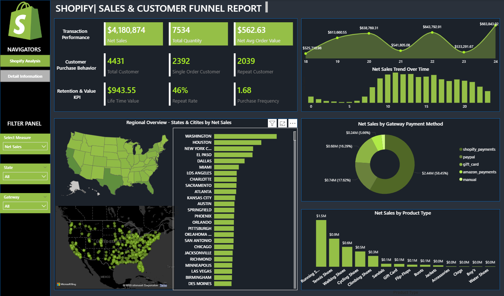

#  Power BI Project – Shopify Business Performance Analysis
- By: Thi Doan
- Date: 10/2025
- Tool Used: `Power Query`, `PowerBi`

# 🧾Table Of Contents (TOCs)
1. [Background & Overview]()
2. [Dataset Description]()
3. [Key Insights & Visualization]()

# 📌Background & Overview
## Objective:
📖What is this project about?
The purpose of this project to build a dashboard using PowerBI to deliver comprehensive view of Shopify sales performance, customer retention, geographic demand, payment behavior, and product mix to support data-driven business decisions.

📖Who is this project for? 
- Business Analysts/ Data Analysts: Using the dashboard to monitor and report KPIS, identify trends and support data-driven recommendations.
- E-commerce/ Operations Managers: Tracking sales performance, customer retention, product mix, and regional demand to optimize operations and inventory.
- Marketing & Growth Teams: Analyzing customer behavior, repeat rates, top regions, and product categories to guide campaigns and retention strategies.
- Finance/ Revenue Teams: Monitoring net sales, AOV, LTV, and payment method mix for revenue planning and forecasting.
- Executives:  Gaining a high-level view of overall business health through executive-ready KPIs and trends.

❓Business Questions:
1. How is overall revenue performing, and are we on track with sales targets over time?
2. Are we getting through repeat customers or relying primarily on new customer acquisition?
3. Which product categories and regions are driving the majority of our revenue?
4. What is the long-term value of our customers, and how sustainable is our revenue base?
5. Where can we focus efforts to increase revenue most efficiently-pricing, retention, product mix, or geographic expansion?

